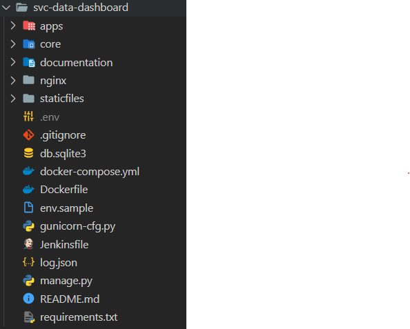
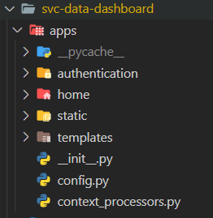
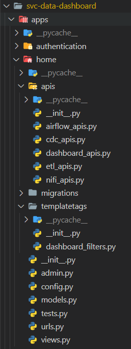
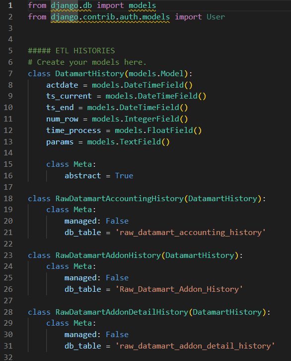
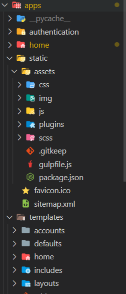
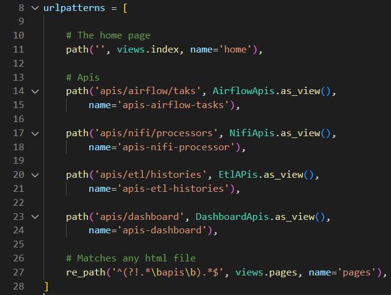
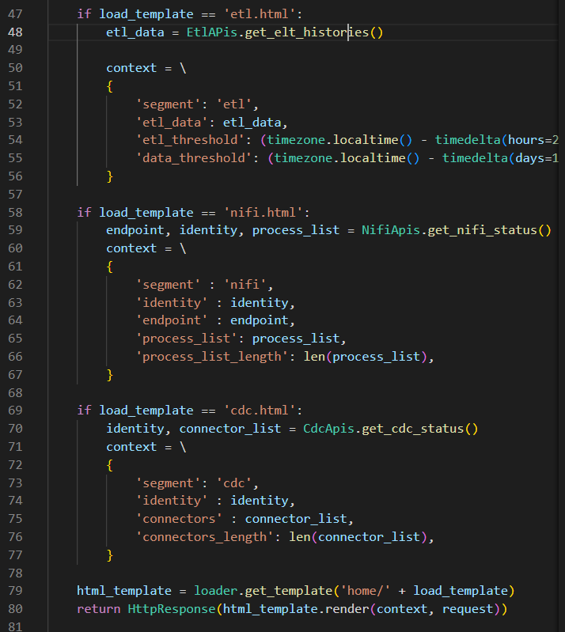

# Features of Data Engineer Dashboard

## <a name="table-of-content">Table of Content</a>
- [Project structure](#structure) 
- [How to add etl item on the etl page](#add-etl) 
- [How to add a new feature](#add-feature) 

## <a name="structure">Project structure</a>
- In this project, there are several important folders and files as follows: 

    - apps : folder to store dashboard application (backend and frontend)
    - core : folder to store django main configuration (database configuration, main router, global settings, etc)
    - db.sqlite3 : django embeded database to store user data
- In the apps folder, we store the dashboard application with an explanation of each folder as follows: 

    - authentication : application that manages user access rights.
    - home : application include main dashboard, airflow, cdc, etl, and nifi pages.
    - static : folder to store css, javascript, and image files
    - templates : folder to store html files.
- the following is an explanation for the home folder. 

    - apis : folder to store backend app
    - templatetags : folder to store value transform function for frontend app
    - models.py : object relational mapping for the database
    - test.py : unit test
    - urls : route for home app
    - views : control data and views (backend and frontend)
## <a name="add-etl">How to add etl item on the etl page</a>
- To add a new etl item to the etl page, there are a few things to do, as follows:
    - Add a new object model to the apps/home/models.py file (you can copy and paste from the existing line code). 
    
    - add your new etl object into apps/home/apis/etl_apis.py file (you can copy and paste from the existing line code).
- After doing the previous steps, the etl list will be automatically updated

## <a name="add-feature">How to add a new feature</a>
- To add a new feature, there are a few things to do, as follows:
    - Create and configure a new api file in the apps/home/apis/ folder. 
    - Create a html page in the apps/home/templates/home folder and create a css/js file in the apps/static/assets folder. 
    
    - Define your api endpoint into apps/home/urls.py file. 
    
    - Configure view in apps/home/views.py file. 
    
