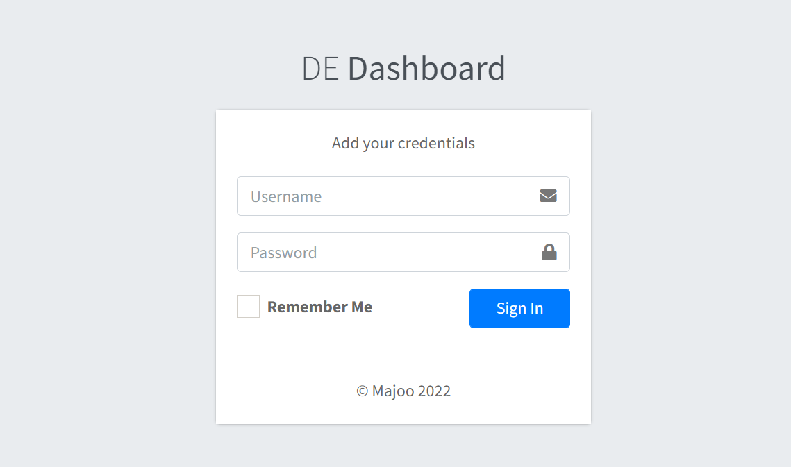
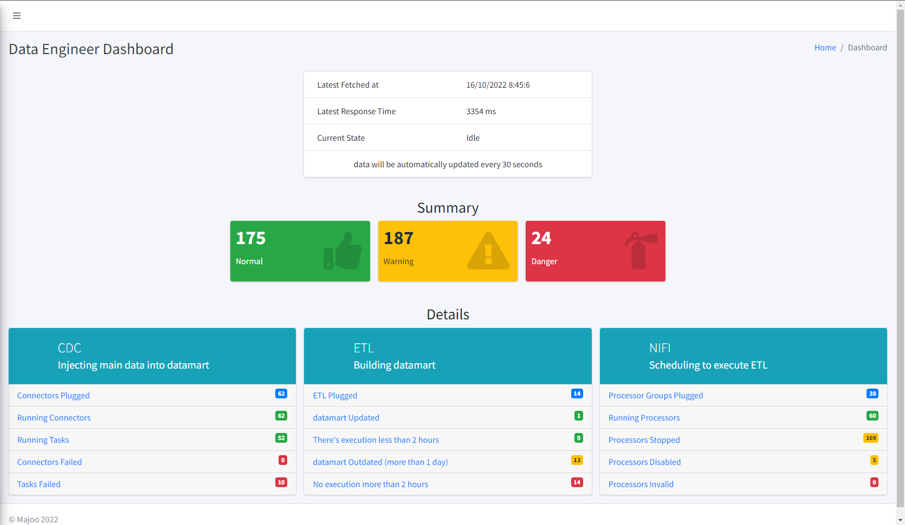
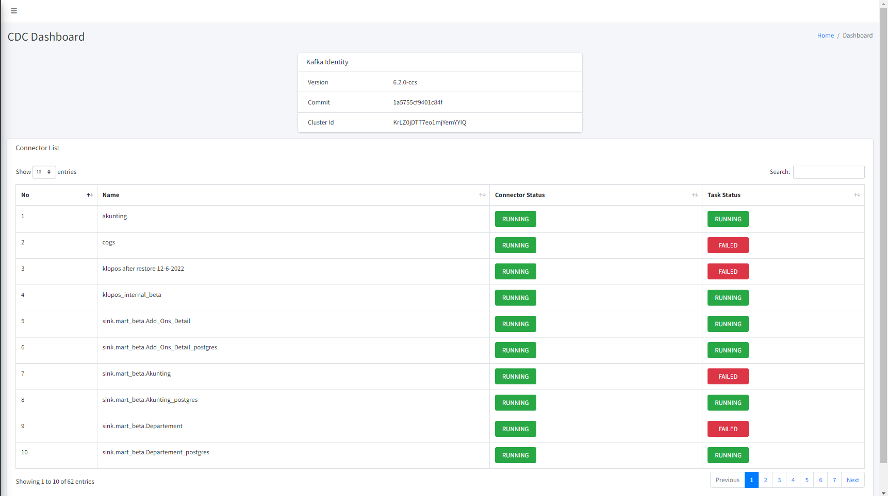
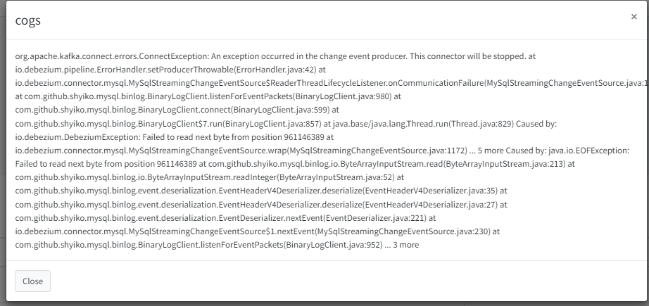
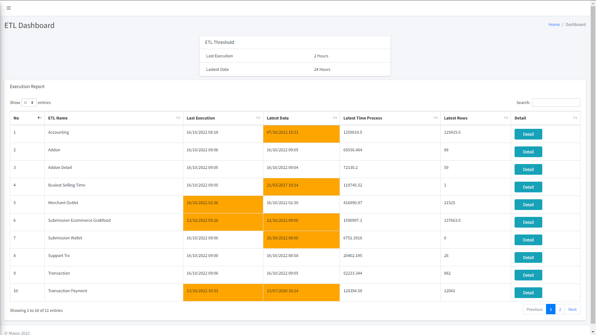
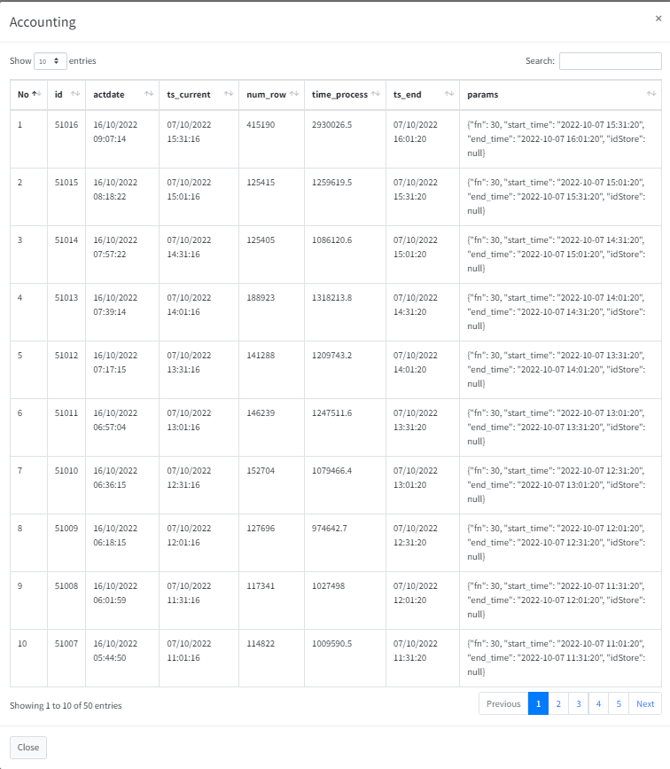
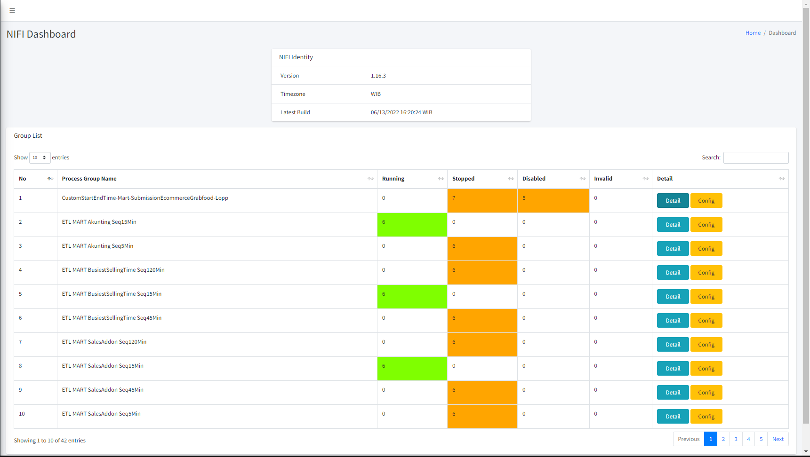
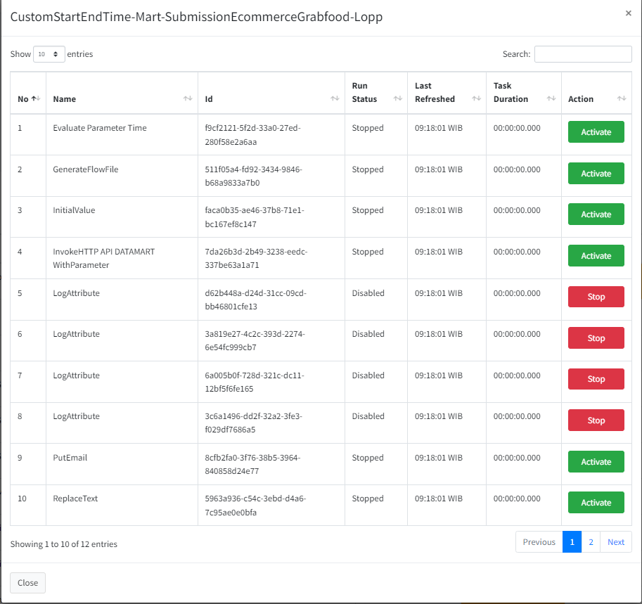
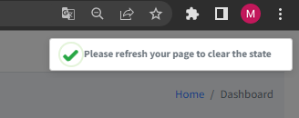

# Features of Data Engineer Dashboard

## <a name="table-of-content">Table of Content</a>
- [How to login into the app](#login) 
- [How to utilize the main dashboard](#main-dashboard) 
- [How to utilize the airflow page](#airflow) 
- [How to utilize the cdc page](#cdc) 
- [How to utilize the etl page](#etl) 
- [How to utilize the nifi page](#nifi) 

## <a name="login">How to login into the app</a>
- Go to the data engineer dashboard
    - Staging : https://data-dashboard.mangkujagat.com/
    - Production : https://data-dashboard.majoo.id/
- You can enter your account in the login form. If you don't have it, you can request an account to the data engineer team. 

## <a name="main-dashboard">How to utilize the main dashboard</a>
- On main dashboard page, we provide a list of status for all data engineer services. We divide service status into three types, as follows:
    - Normal : service is going well.
    - Warning : service has problems, but doesn't interfere with the main service activities.
    - Danger : service has problems that interfere with the main service activities. This problem must be solved immediately. 

- On this page, we also provide detailed information of each status in the "Details" section.
- The information displayed on this page will be updated every 30 seconds automatically.

## <a name="airflow">How to utilize the airflow page</a>
- TODO

## <a name="cdc">How to utilize the cdc page</a>
- On cdc page, we provide kafka and debezium status information for each cdc process. 

- If you find a status that is "Failed", you can tap on that status to see the details of the error. 

## <a name="etl">How to utilize the etl page</a>
- On etl page, we provide activity logs from all over etl with the following description:
    - Last execution : last time etl executed
    - Lastest data : the most recent etl result data
- On this page, we also give an orange mark for each process that passes the threshold (threshold can be seen in the ETL threshold section). 

- We also provide detailed information in the form of the last 50 logs which can be viewed by pressing the detail button for each etl. 

## <a name="nifi">How to utilize the nifi page</a>
- On nifi page, we provide processor group information and state of each processor. 

- You can enter the nifi UI page for each processor group by pressing the config button. If you just want to do a simple configuration, you can press the detail button.
- On the detail page, you can set the state of each processor (activate / stop) 

- When you change the state of the processor, you will get a notification in the right corner of your browser screen. If you get a failed status, the error details will be displayed on the notification.
- If the process of changing status is successful. you will be asked to refresh your page manually to refresh the data on the main nifi page. We don't refresh your page automatically to make it easier for you to do several actions at once. 
